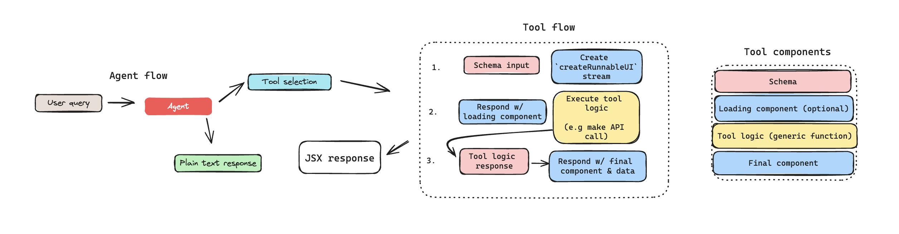

# Generative UI with LangChain.js 🦜🔗



## Overview

This application aims to provide a template for building generative UI applications with LangChain.js.
It comes pre-built with a few UI features which you can use to play about with gen ui. The UI components are built using [Shadcn](https://ui.shadcn.com/).

## Getting Started

### Installation

First, clone the repository and install dependencies:

```bash
git clone https://github.com/bracesprou/gen-ui.git

cd gen-ui

yarn install
```

Next, if you plan on using the existing pre-built UI components, you'll need to set a few enviroment variables:

Copy the [`.env.example`](./.env.example) file to `.env`:

The `OPENAI_API_KEY` is required. LangSmith keys are optional, but highly recommended if you plan on developing this application further.

Get your OpenAI API key from the [OpenAI dashboard](https://platform.openai.com/login?launch).

[Sign up/in to LangSmith](https://smith.langchain.com/) and get your API key.

Create a new [GitHub PAT (Personal Access Token)](https://github.com/settings/tokens/new) with the `repo` scope.

[Create a free Geocode account](https://geocode.xyz/api).

```bash
# ------------------LangSmith tracing------------------
LANGCHAIN_API_KEY=...
LANGCHAIN_CALLBACKS_BACKGROUND=true
LANGCHAIN_TRACING_V2=true
# -----------------------------------------------------

GITHUB_TOKEN=...
OPENAI_API_KEY=...
GEOCODE_API_KEY=...
```

### Running the Application

To run the application in development mode run:

```bash
yarn dev
```

This will start the application on [`http://localhost:3000`](http://localhost:3000).

To run in production mode:

```bash
yarn start

yarn build
```

### Go further

If you're interested in ways to take this demo application further, I'd consider the following:

- A custom LangGraph agent instead of the default `AgentExecutor` amd `createToolCallingAgent`
- Adding a "classifier" step before the tool call, with a small fast model (e.g Claude 3 Haiku) which selects the tool call/component first. This would improve overall latency for the time to first UI (with the loading state component).
